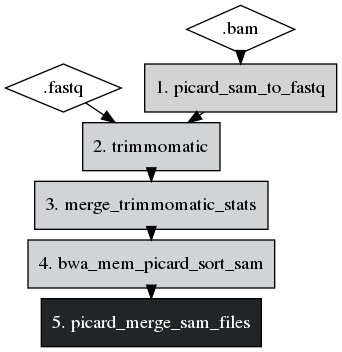
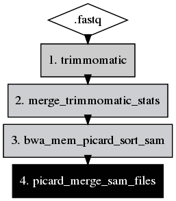

# Flowchart-creator-for-GenPipes
Code for implementing a test flowchart in python for the 5 first steps of the DNAseq pipeline.
It is a flow-chart creator that automatically builds the flowchart from the steps chosen by the user. This happens when we add the decorator @TraceCalls() before every step in the pipeline. As the development of these pipelines is in constant evolution, the change can be easily incorporated in the flowchart creator by adding or removing the decorator.

Black box - Steps on multiple readsets
Grey box - Step per readset
Diamond box - Input file (type)

Output looks like this when all five functions are called-

And like this when first function is not called-

